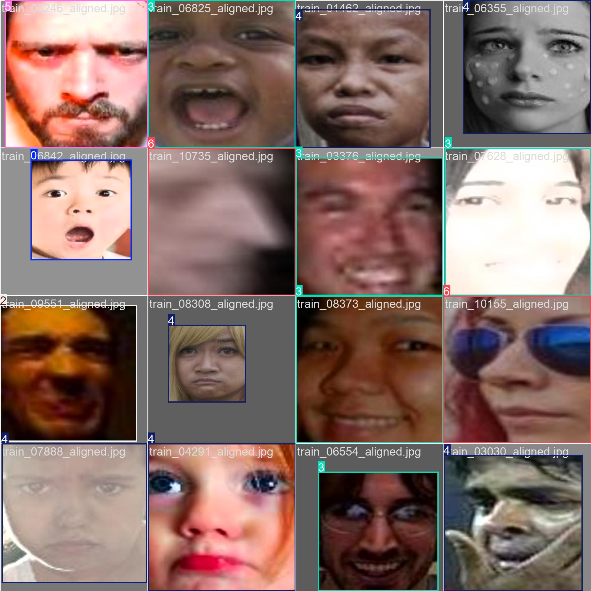

# Training Results

Below are the artifacts generated during the YOLOv8 training run in `runs/train/yolo_mood/`.

---

## Summary Plot

  
*Combined view of key metrics (loss, precision, recall, mAP) over all epochs.*

---

## Loss & Score Curves

  
*Box, classification, and DFL losses vs. epoch.*

  
*Precision and mAP@0.5 vs. epoch.*

---

## Bounding‑Box Metrics

  
*Box Precision vs. epoch.*

  
*Box Recall vs. epoch.*

  
*Box F1‑Score vs. epoch.*

  
*Precision–Recall curve for bounding‑boxes.*

---

## Confusion Matrices

  
*Raw counts of predicted vs. true classes.*

  
*Normalized (percentage) confusion matrix.*

---

## Sample Training Batches

### Early Batches  
  
  
  

### Later Batches  
  
  
  

---

## Validation Snapshots (during training)

  
  

  
  

  
  

---

## Configuration

- **args.yaml**  
  Contains the training hyperparameters and settings used for this run.

---

## Raw Metrics

- **results.csv**  
  Epoch‑wise metrics (losses, precision, recall, mAP, learning rates).

---