# Validation Results

Below are the validation outputs from `runs/val/yolo_mood_val/`.

---

## Box Precision Curve  
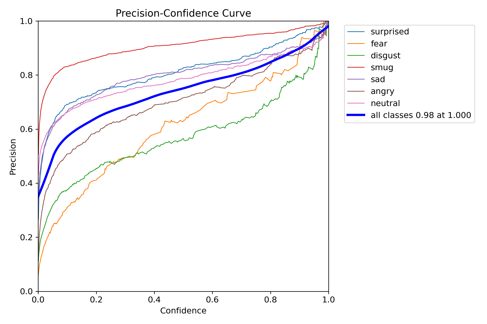  
*Precision of bounding‑box predictions vs. validation epochs. Higher is better—shows how accurately the model localizes faces over time.*

## Box Recall Curve  
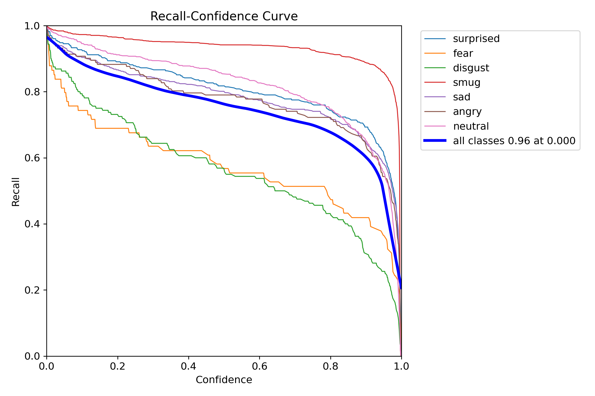  
*Recall of bounding‑box predictions vs. validation epochs. Indicates the model’s ability to find all faces.*

## Box F1‑Score Curve  
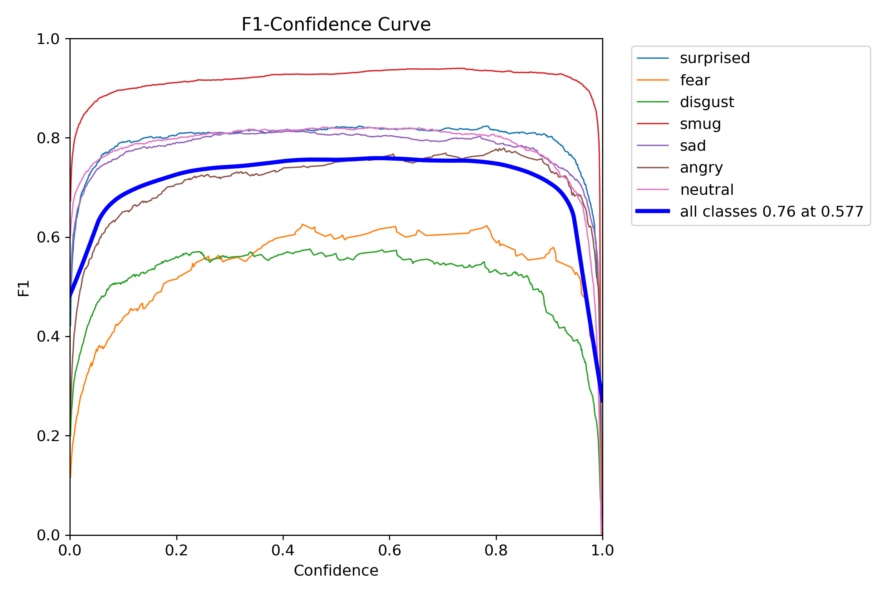  
*Harmonic mean of precision and recall vs. validation epochs. Balances detection accuracy and completeness.*

## Box Precision–Recall Curve  
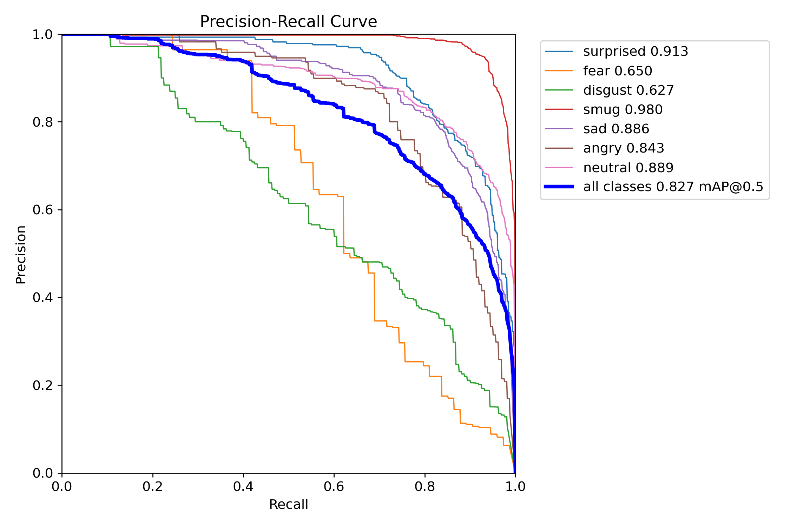  
*Precision–Recall trade‑off for face detection on the validation set. Illustrates performance at different confidence thresholds.*

---

## Confusion Matrices

### Raw Confusion Matrix  
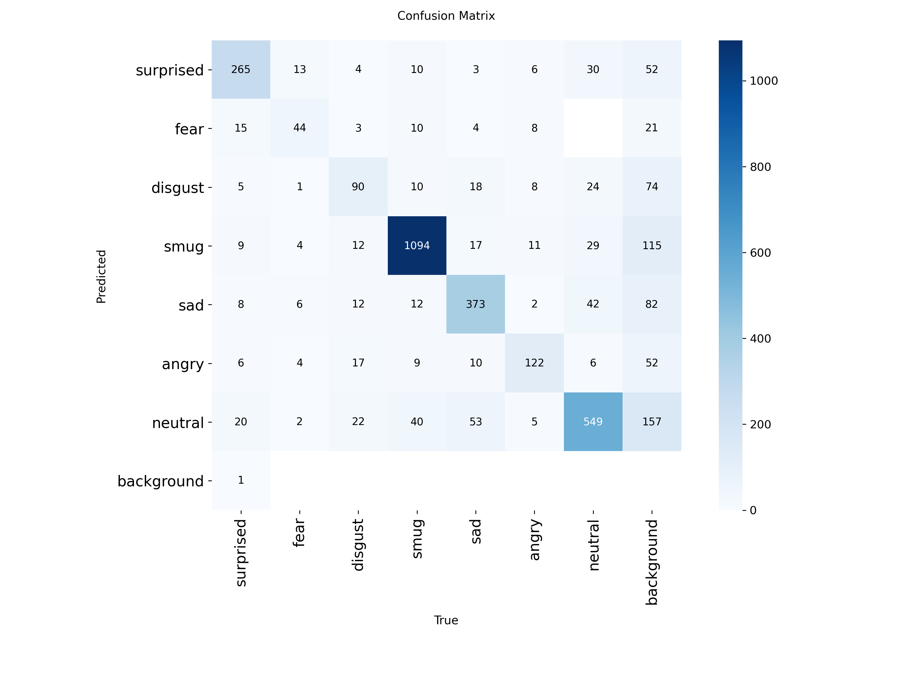  
*Counts of predicted mood labels vs. true labels. Diagonal entries are correct predictions.*

### Normalized Confusion Matrix  
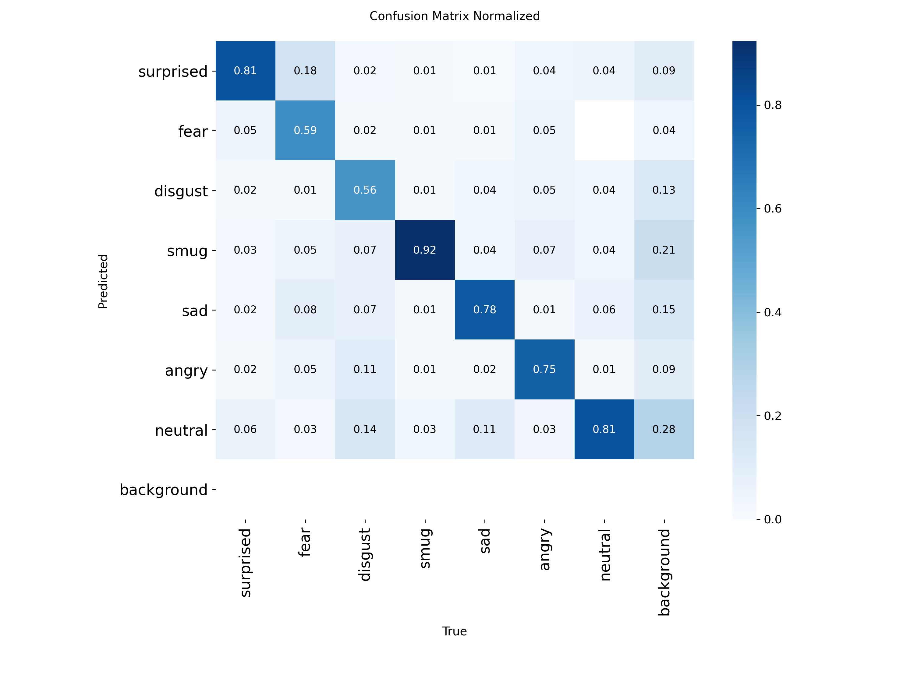  
*Percentages of predictions per true class. Helps spot systematic biases or misclassifications.*

---

## Sample Batch Visualizations

### Batch 0 – Ground Truth  
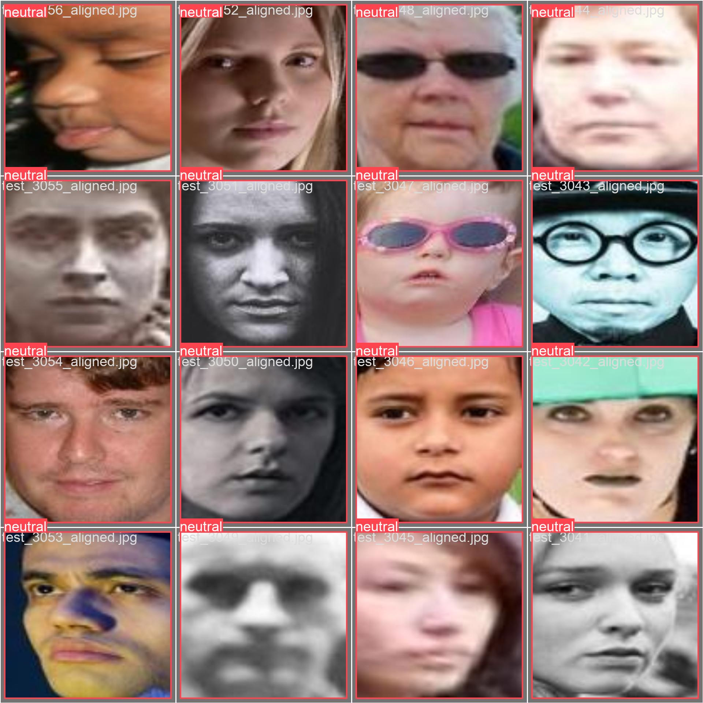  
*Validation images with ground‑truth bounding boxes and mood labels.*

### Batch 0 – Predictions  
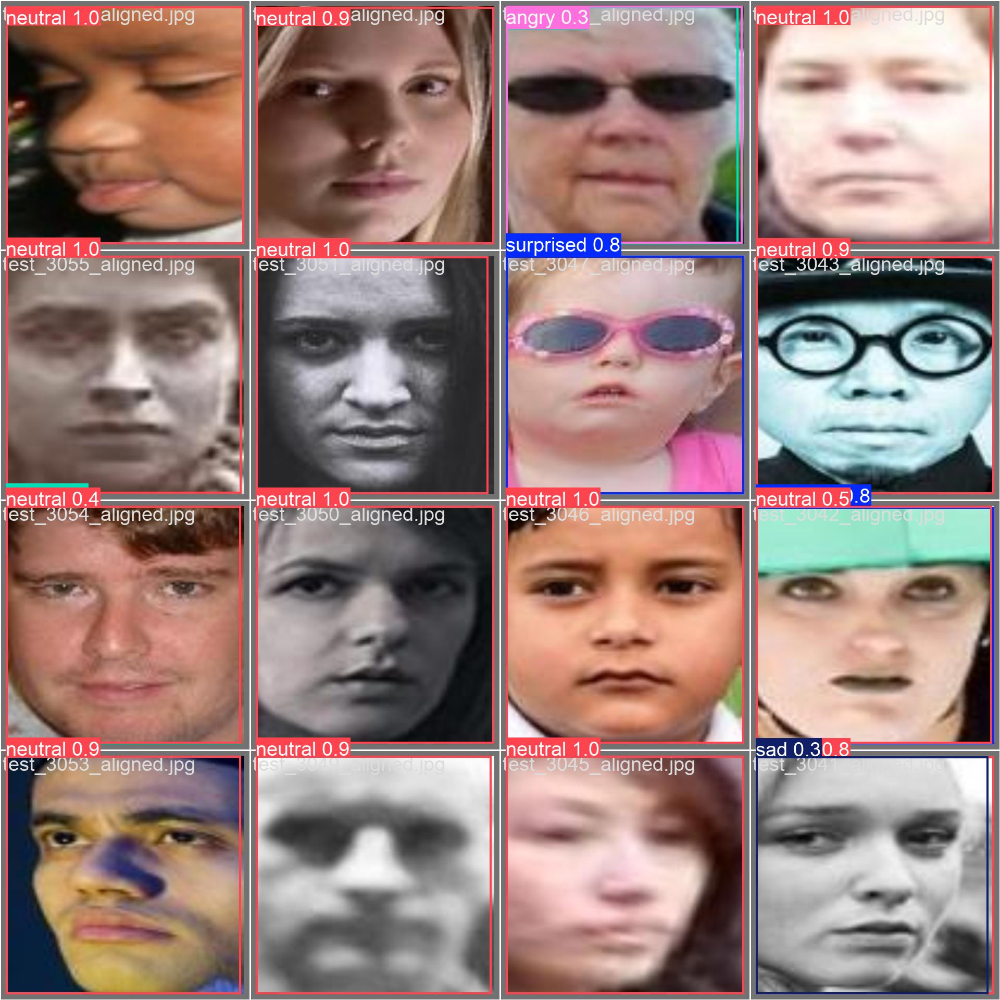  
*Same images with the model’s predicted boxes and labels for comparison.*

---

### Batch 1 – Ground Truth  
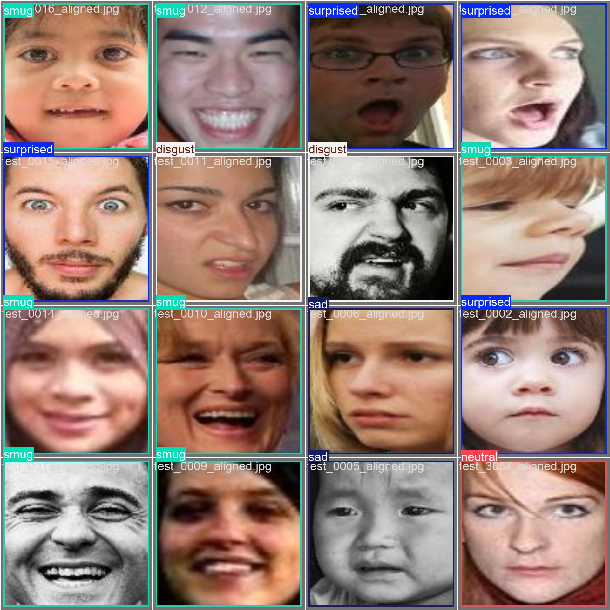  
*Validation images with ground‑truth boxes and labels.*

### Batch 1 – Predictions  
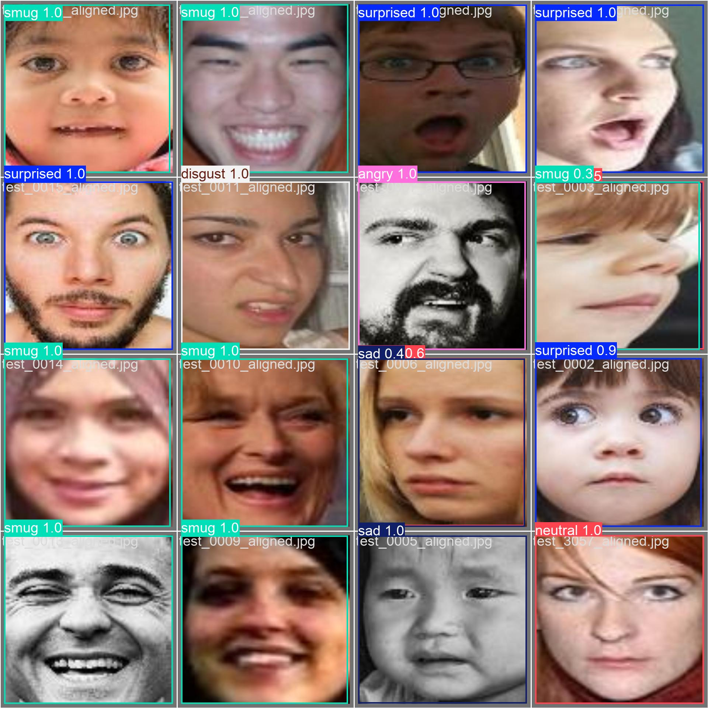  
*Model’s predictions on batch 1 for visual inspection.*

---

### Batch 2 – Ground Truth  
  
*Validation images with ground‑truth boxes and labels.*

### Batch 2 – Predictions  
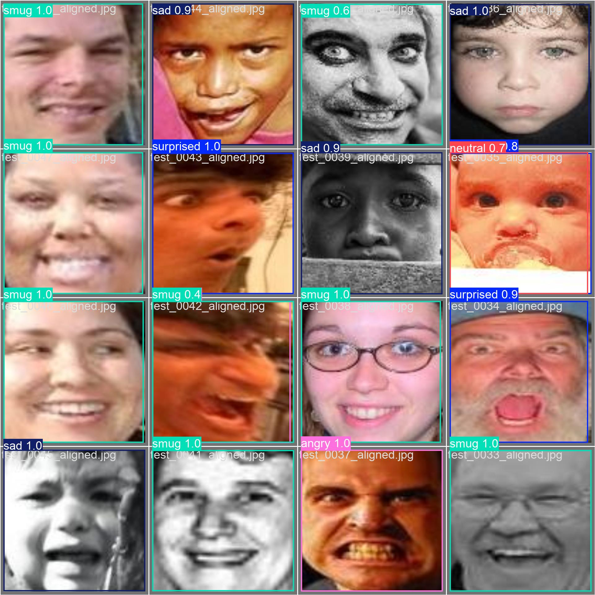  
*Model’s predicted boxes and labels on batch 2.*

---